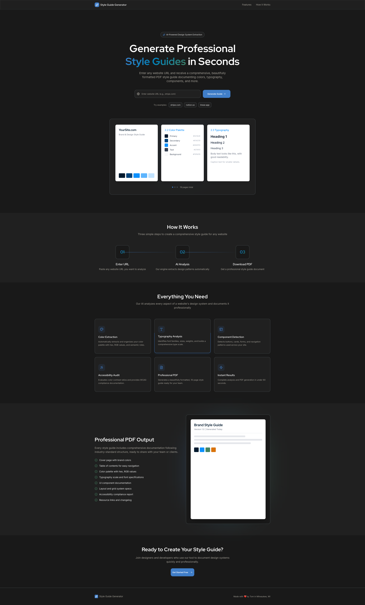
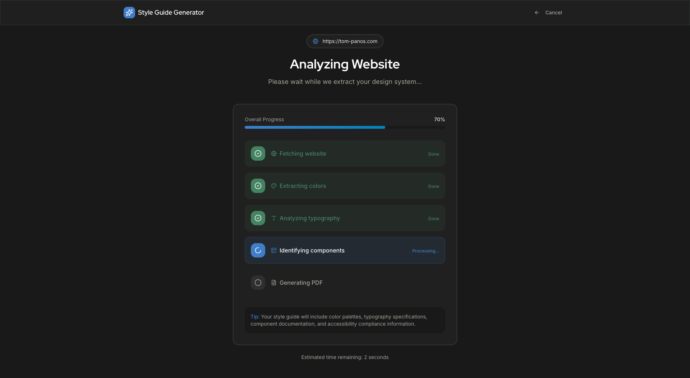
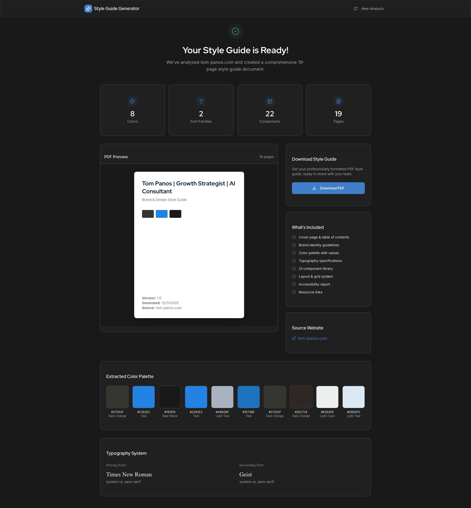

# Creative Brief Builder

> **AI-Powered Creative Brief Generator** — Upload your marketing assets and instantly receive a comprehensive creative brief documenting visual style, brand voice, messaging strategy, and audience insights.

[](https://www.typescriptlang.org/)
[](https://react.dev/)
[](https://vitejs.dev/)
[](https://www.netlify.com/)

---

## 📖 Overview

**Creative Brief Builder** transforms your marketing images into professional creative briefs in under 60 seconds. Powered by Google's Gemini 2.5 Flash AI model, it analyzes your brand assets and generates a beautifully formatted PDF documenting your visual identity, brand voice, messaging strategy, and strategic recommendations.

Perfect for:
- **Designers** needing to document brand systems quickly
- **Marketing teams** creating brand guidelines
- **Agencies** onboarding new clients
- **Freelancers** delivering professional brand documentation

### What It Analyzes

Upload 1-3 marketing images (logos, ads, social posts, landing pages) and receive:

- **Visual Style** — Color palettes with hex codes, typography hierarchy, layout patterns, visual motifs
- **Brand Voice** — Tone analysis, personality traits, emotional appeal
- **Messaging** — Key themes, call-to-action styles, value propositions
- **Target Audience** — Inferred demographics and psychographics
- **Strategic Recommendations** — Actionable dos, don'ts, and content ideas

---

## 🚀 Quick Start

### Prerequisites

- **Node.js** (v18 or higher)
- **Google Gemini API Key** ([Get one free here](https://aistudio.google.com/app/apikey))

### Installation

```bash
# Clone the repository
git clone https://github.com/TomsTools11/creative-brief-builder.git
cd creative-brief-builder

# Install dependencies
npm install

# Configure environment
echo "GEMINI_API_KEY=your_api_key_here" > .env.local

# Start development server
npm run dev
```

The app will be running at `http://localhost:3000`

---

## ⚙️ Environment Configuration

Create a `.env.local` file in the project root:

```env
GEMINI_API_KEY=your_gemini_api_key_here
```

**Getting your API key:**
1. Visit [Google AI Studio](https://aistudio.google.com/app/apikey)
2. Sign in with your Google account
3. Click "Create API Key"
4. Copy and paste into `.env.local`

> **Note:** The free tier includes 15 requests per minute, which is sufficient for personal use.

---

## 🛠️ Tech Stack

| Technology | Purpose |
|------------|---------|
| **React 19.2** | UI framework with latest features |
| **TypeScript** | Type-safe development |
| **Vite** | Lightning-fast build tool and dev server |
| **Google Gemini 2.5 Flash** | AI model for image analysis |
| **jsPDF** | PDF generation for creative briefs |
| **Lucide React** | Beautiful icon library |
| **Netlify** | Deployment and serverless functions |

---

## 📁 Project Structure

```
creative-brief-builder/
├── components/
│   ├── UploadZone.tsx        # Image upload interface (max 3 images, 5MB each)
│   └── BriefResult.tsx        # Results display and PDF export
├── services/
│   ├── geminiService.ts       # Gemini API integration
│   └── imageUtils.ts          # Image resizing/compression
├── netlify/
│   └── functions/
│       └── analyze.ts         # Serverless API endpoint
├── types.ts                   # TypeScript interfaces
├── constants.ts               # Configuration (limits, dimensions)
├── App.tsx                    # Main component (state machine)
└── index.tsx                  # Application entry point
```

### Key Features

- **Smart Image Processing** — Auto-resizes to 1024px max dimension, converts to JPEG at 85% quality
- **Structured JSON Schema** — Enforces consistent AI responses via Gemini's schema feature
- **State Machine Architecture** — Clean transitions: `upload` → `analyzing` → `results`
- **Instant PDF Export** — Generate professional 10-page creative briefs with one click
- **Responsive Design** — Works seamlessly on desktop, tablet, and mobile

---

## 📜 Available Scripts

| Command | Description |
|---------|-------------|
| `npm run dev` | Start development server on port 3000 |
| `npm run build` | Production build (outputs to `dist/`) |
| `npm run preview` | Preview production build locally |

---

## 🌐 Deployment

### Deploy to Netlify

This project is optimized for Netlify with zero configuration:

1. **Connect Repository**
   - Go to [Netlify](https://app.netlify.com/)
   - Click "Add new site" → "Import an existing project"
   - Select this GitHub repository

2. **Configure Build Settings** (auto-detected)
   - **Build command:** `npm install && npm run build`
   - **Publish directory:** `dist`
   - **Functions directory:** `netlify/functions`

3. **Set Environment Variables**
   - Go to Site settings → Environment variables
   - Add `GEMINI_API_KEY` with your API key

4. **Deploy**
   - Click "Deploy site"
   - Your app will be live at `your-site.netlify.app`

### Deploy to Other Platforms

The app is a standard Vite + React build and works with any static hosting:

- **Vercel:** Works out of the box
- **Cloudflare Pages:** Use build command `npm run build` and output `dist/`
- **GitHub Pages:** Add base path in `vite.config.ts`

---

## 🎨 Design System

The app uses a custom design system with:

- **Dark theme UI** optimized for professional tools
- **Gradient borders** for premium feel
- **Custom animations** (fade-in, progress bars, card hovers)
- **Tailwind-like utility classes** via custom CSS
- **Responsive typography** scale from caption (11px) to display (56px)

See `brief-builder-style-guide.pdf` for full design documentation.

---

## 📸 Screenshots

| Landing Page | Analysis Progress | Results Preview |
|--------------|-------------------|-----------------|
|  |  |  |

---

## 🔒 Privacy & Security

- **No data storage** — All processing happens in your browser and Google's API
- **No tracking** — Zero analytics or third-party scripts
- **API key security** — Environment variables never exposed to client code
- **Image processing** — Images compressed locally before API transmission

---

## 🤝 Contributing

Contributions welcome! Please:

1. Fork the repository
2. Create a feature branch (`git checkout -b feature/amazing-feature`)
3. Commit your changes (`git commit -m 'Add amazing feature'`)
4. Push to the branch (`git push origin feature/amazing-feature`)
5. Open a Pull Request

---

## 📝 License

This project is open source and available under the [MIT License](LICENSE).

---

## 🙏 Acknowledgments

- Built with ❤️ by [Tom in Milwaukee, WI](https://tom-panos.com)
- Powered by [Google Gemini AI](https://ai.google.dev/)
- Icons by [Lucide](https://lucide.dev/)
- Part of [DocBuildr](https://docbuildr.app) suite of tools

---

## 📞 Support

- **Issues:** [GitHub Issues](https://github.com/TomsTools11/creative-brief-builder/issues)
- **Documentation:** See [CLAUDE.md](CLAUDE.md) for developer guidance
- **API Documentation:** [Google Gemini API Docs](https://ai.google.dev/docs)

---

<div align="center">

**[Try it Live](https://creative-brief.netlify.app)** | **[Report Bug](https://github.com/TomsTools11/creative-brief-builder/issues)** | **[Request Feature](https://github.com/TomsTools11/creative-brief-builder/issues)**

Made with ❤️ using Google Gemini AI

</div>
